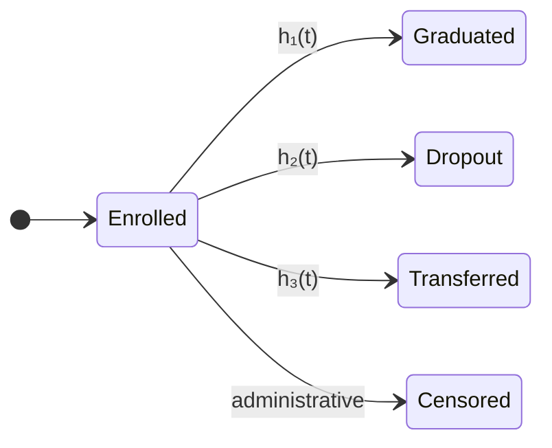

## Alan Profeta

Undergraduate in Data Science and Artificial Intelligence — **UFSCar Sorocaba**, Brazil.

I work at the intersection of probability and ill-behaved problems: university
dropout under competing risks, regime structure in financial markets, and
information dynamics on networks. I came to AI safety from the uncertainty
quantification side rather than the alignment-theory side.

Full site, in Portuguese and English → **[alanprofeta.github.io](https://alanprofeta.github.io)**

---

### Survival analysis with competing risks

*Ongoing undergraduate research project (Iniciação Científica), Bayesian, applied to university dropout.*

The usual shortcut is to model dropout as a single absorbing event. It is wrong in a
specific and consequential way: a student who leaves, one who transfers, and one who
graduates are not the same object, and treating the last two as "censored" biases the
first one upward.

Each terminal state gets its own cause-specific hazard. With a shared frailty $u_i$
absorbing unobserved heterogeneity between students (cohort, program, campus):

$$h_k(t \mid Z_i, u_i) \;=\; u_i \, h_{0k}(t) \, \exp(\beta_k^\top Z_i), \qquad k = 1, \dots, K$$

The subtlety that motivates the whole thing: the quantity a university actually needs
for policy is the **cumulative incidence** of dropout, and that is *not* $1 - S_k(t)$
once other causes compete for the same student. It has to integrate over the all-cause
survival,

$$F_k(t) \;=\; \int_0^t S(u^-)\, h_k(u) \, \mathrm{d}u$$

which is why the naive one-risk model does not just lose precision — it answers a
different question than the one being asked.

**Keywords** — competing risks · frailty · Bayesian inference · student retention

---

### Quantitative finance and complex systems

Two threads. The first is a three-layer strategy on B3 (Brazilian exchange) equities,
where each layer answers a different question about the same series:

Decomposition separates timescales, regime classification asks *which* market we are
currently in, and the hazard layer asks *how long* the current regime is likely to
survive — which is what actually sets exposure. The safeguards against look-ahead bias
are explicit at every layer, since each one is an opportunity to leak the future into
the past.

> No performance figures are published, by design. The method is the artifact; a
> backtest curve is not evidence, and presenting one as a result would be a different
> kind of claim than I want to make.

The second thread is rumor propagation on networks — classical Daley–Kendall and
Maki–Thompson models assume the content being spread is timeless. It isn't. Adding
content obsolescence introduces a second random variable (time until the environment
changes) racing against the propagation time, which changes the qualitative behaviour
of the process rather than just its constants. Research note in preparation.

**Keywords** — market regimes · MODWT · Hawkes processes · contagion · rumor dynamics

---

### Probabilistic robotics

Conceptual axis of the robotics and AI student group currently being founded at UFSCar
Sorocaba: state estimation, filtering, and decision-making under uncertainty in
physical agents. Early stage — the group exists, the research output does not yet.

---

### Watchlist

Areas I am testing, with no project attached yet — listed here as direction, not as
credentials: **AI for scientific simulation** (whether the same Bayesian and stochastic
process machinery transfers to reaction modeling or inference on noisy biological data),
extreme value theory, and causal inference.

---

### Teaching

Teaching material is research output, not a hobby. A multi-file LaTeX study guide for
Calculus I, built around intuition before formalism, and a Manim animation of the Monty
Hall problem in Portuguese — conditional probability is where most students' intuition
first betrays them, and it is worth the effort of animating.

---

### Tooling

Julia and Python for modeling — the Hawkes replication runs on Julia with PythonCall.jl.
LaTeX and Manim for teaching material. My site is hand-written HTML — no framework, no
build step.

---

**[Site](https://alanprofeta.github.io)** ·
**[Lattes](http://lattes.cnpq.br/7022065851389897)** ·
**[alanprofeta@estudante.ufscar.br](mailto:alanprofeta@estudante.ufscar.br)**
